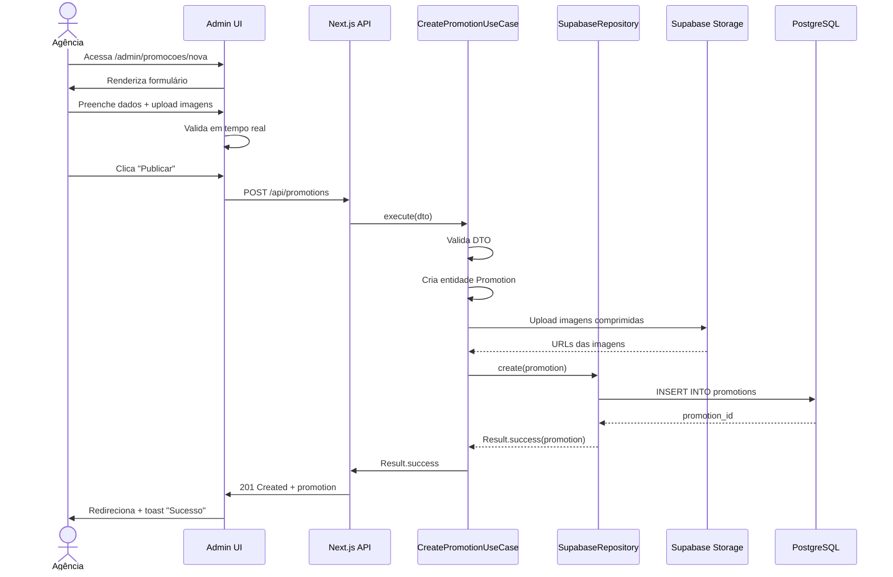
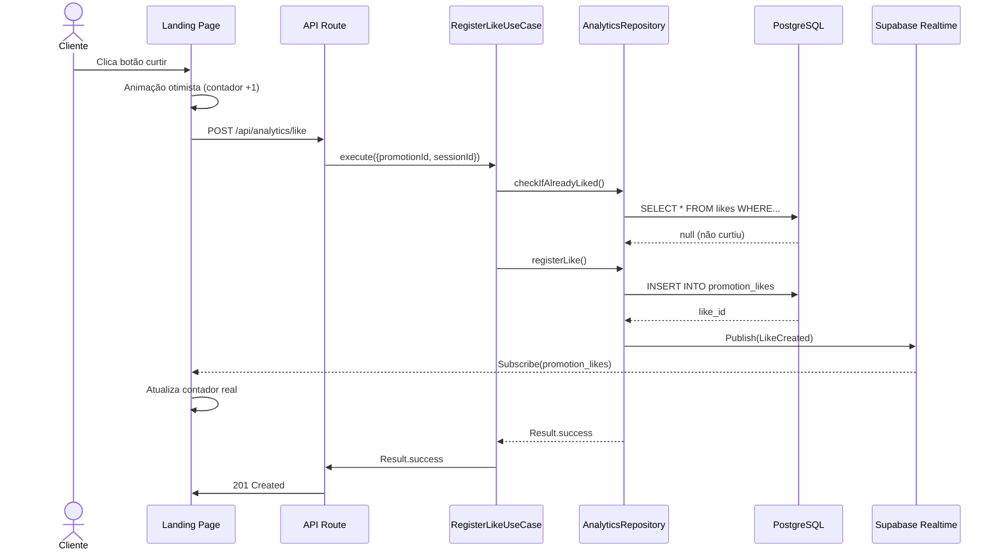

# PRD - Sistema de Gerenciamento de Promoções META21

## Metadados do Documento
```yaml
versão: 1.0.0
data_criação: 2026-03-06
última_atualização: 2026-03-06
status: Em Revisão
product_owner: Equipe META21
stakeholders:
  - Gerentes de Unidades (3 unidades)
  - Agência de Publicidade
  - Clientes finais (milhares)
próxima_revisão: 2026-03-20
ciclo_sprint: 2 semanas
```

---

## Sumarização Executiva das Features

### 🎯 Problema Central
Rede de supermercados com 3 unidades possui processo manual ineficiente de comunicação de promoções via WhatsApp em múltiplos grupos, sem rastreabilidade, governança ou analytics de engajamento.

### 💡 Solução Proposta
Sistema web centralizado tipo "calendário elegante" com link único compartilhável em redes sociais, permitindo gestão profissional de promoções com histórico completo, evidência jurídica de publicação e analytics de curtidas para identificar produtos de maior interesse.

### 📊 Features Principais (MVP)

| Feature | Prioridade | Status | Sprint |
|---------|-----------|--------|--------|
| CRUD de Promoções | P0 | Planejada | 1-2 |
| Upload e Compressão de Imagens | P0 | Planejada | 2 |
| Calendário Visual Admin | P0 | Planejada | 3 |
| Landing Page Pública (Link Único) | P0 | Planejada | 3 |
| Curtidas Anônimas | P0 | Planejada | 4 |
| Dashboard de Analytics | P1 | Planejada | 5 |
| Autenticação Google OAuth | P0 | Planejada | 1 |
| Cadastro Incremental de Produtos | P1 | Planejada | 2 |
| Sistema de Comentários Moderados | P2 | Backlog | - |
| Multi-unidade (Filtros) | P1 | Backlog | - |

**Legenda de Prioridades:**
- **P0:** Blocker (não lança MVP sem isso)
- **P1:** Crítico (entrega logo após MVP)
- **P2:** Importante (pode esperar Fase 2)
- **P3:** Nice to have

---

## 1. Visão do Produto

### 1.1 Declaração de Visão

> "Criar uma experiência digital elegante e eficiente para comunicação de promoções de supermercado, substituindo processos manuais por um sistema profissional com rastreabilidade jurídica e inteligência de engajamento."

### 1.2 Objetivos de Negócio

**Mensuráveis:**
1. Reduzir tempo de publicação de promoções de ~2h para ~10min (90% redução)
2. Eliminar criação de grupos WhatsApp (de infinitos para 0)
3. Atingir 70% de taxa de clique (CTR) no link único nas primeiras 4 semanas
4. Gerar insights semanais sobre top 10 produtos mais curtidos

**Qualitativos:**
1. Melhorar percepção de profissionalismo da marca
2. Reduzir atrito operacional da agência de publicidade
3. Criar histórico auditável para compliance jurídico

### 1.3 Não-Objetivos (Out of Scope - MVP)

- ❌ E-commerce (compra online)
- ❌ Programa de fidelidade
- ❌ Integração com PDV/ERP
- ❌ App mobile nativo (apenas PWA futuro)
- ❌ Notificações push (Fase 2)

---

## 2. Personas

### Persona 1: Paula — Gerente de Marketing da Agência

**Demografia:**
- Idade: 32 anos
- Cargo: Coordenadora de Contas
- Experiência: 8 anos em publicidade

**Contexto:**
- Gerencia 5 clientes simultaneamente
- Pressão por entregas rápidas
- Frustração com processos manuais

**Objetivos:**
- Publicar promoções em < 15 minutos
- Interface bonita para impressionar cliente
- Não precisar de suporte técnico

**Dores:**
- Criação infinita de grupos WhatsApp
- Perda de histórico de promoções antigas
- Dificuldade em mensurar ROI de campanhas

**Jobs to Be Done:**
> "Quando preciso publicar promoções semanais, quero um sistema intuitivo e rápido, para que eu possa focar em estratégia criativa ao invés de tarefas operacionais."

---

### Persona 2: Roberto — Gerente de Supermercado (Unidade Centro)

**Demografia:**
- Idade: 45 anos
- Cargo: Gerente de Loja
- Experiência: 20 anos no varejo

**Contexto:**
- Define promoções baseado em estoque parado
- Precisa respaldo jurídico em caso de reclamações
- Não tem tempo para usar sistemas complexos

**Objetivos:**
- Aprovar promoções rapidamente
- Ter evidência de quando/o que foi publicado
- Saber quais produtos geram mais interesse

**Dores:**
- Clientes reclamando de promoção "não encontrada"
- Falta de controle sobre o que foi publicado
- Não sabe se vale a pena investir em determinado produto

**Jobs to Be Done:**
> "Quando um cliente reclama de uma promoção, quero acessar o histórico completo de publicações, para que eu tenha evidência concreta do que foi divulgado e quando."

---

### Persona 3: Carla — Cliente Final (Usuária do Link)

**Demografia:**
- Idade: 38 anos
- Ocupação: Professora
- Localização: Bairro próximo à unidade

**Contexto:**
- Faz compras semanais
- Planeja compras com base em promoções
- Usa Instagram e WhatsApp diariamente

**Objetivos:**
- Ver promoções atuais de forma rápida
- Comparar preços antes de ir ao mercado
- Curtir produtos que tem interesse

**Dores:**
- Links quebrados em stories antigos
- Grupos WhatsApp lotados de spam
- Não encontra histórico de promoções

**Jobs to Be Done:**
> "Quando estou planejando minhas compras da semana, quero ver todas as promoções atuais em um só lugar, para que eu possa economizar tempo e dinheiro."

---

## 3. Requisitos Funcionais Detalhados

### 3.1 Módulo: Gerenciamento de Promoções

#### RF-001: Criar Promoção
**Prioridade:** P0  
**Sprint:** 1-2

**Descrição:**  
Sistema deve permitir que usuários autenticados criem promoções com dados estruturados e imagens.

**Critérios de Aceite:**
- [ ] Formulário com validação em tempo real
- [ ] Campos obrigatórios:
  - Título (max 255 caracteres)
  - Nome do produto (autocomplete de produtos já cadastrados)
  - Preço DE (decimal, 2 casas)
  - Preço POR (decimal, 2 casas)
  - Data válida DE (date picker)
  - Data válida ATÉ (date picker, > que DE)
  - Pelo menos 1 imagem (max 5 imagens)
- [ ] Campos opcionais:
  - Descrição (rich text, max 1000 caracteres)
  - Tag "Promoção Destaque" (boolean)
  - Seleção de unidade (dropdown, default: todas)
- [ ] Upload de imagens:
  - Formatos aceitos: JPG, PNG, WebP
  - Tamanho máximo individual: 5MB
  - Compressão automática para < 500KB
  - Preview antes do upload
- [ ] Cálculo automático de % desconto
- [ ] Salvar rascunho automaticamente a cada 30s
- [ ] Botões: "Salvar Rascunho" | "Publicar"

**Regras de Negócio:**
- RN-001: Data válida ATÉ deve ser posterior a Data válida DE
- RN-002: Preço POR deve ser menor que Preço DE
- RN-003: Produtos novos são automaticamente cadastrados no banco
- RN-004: Imagens são comprimidas antes do upload (quality: 80)
- RN-005: Título deve ser único dentro do mesmo período de validade

**Fluxo Principal:**
```
1. Usuário acessa /admin/promocoes/nova
2. Sistema renderiza formulário vazio
3. Usuário preenche dados
4. Sistema valida em tempo real (debounce 500ms)
5. Usuário faz upload de imagens
6. Sistema comprime e mostra preview
7. Usuário clica "Publicar"
8. Sistema valida todos os campos
9. Sistema persiste no banco (status: published)
10. Sistema registra metadados (created_by, published_at)
11. Sistema redireciona para /admin/promocoes/{id}
12. Sistema exibe toast "Promoção publicada com sucesso"
```

**Fluxo Alternativo (Erro de Validação):**
```
8a. Sistema detecta erro de validação
8b. Sistema destaca campo com erro (border vermelho)
8c. Sistema exibe mensagem específica abaixo do campo
8d. Sistema mantém dados preenchidos
8e. Retorna ao passo 3
```

**Casos de Teste:**
```typescript
// CT-001: Criação válida
Input: {
  title: "Arroz Tipo 1 - Super Oferta",
  productName: "Arroz Tio João 5kg",
  priceFrom: 29.90,
  priceTo: 19.90,
  validFrom: "2026-03-15",
  validUntil: "2026-03-20",
  images: [file1.jpg]
}
Expected: Status 201, promotionId retornado

// CT-002: Data inválida
Input: { validFrom: "2026-03-20", validUntil: "2026-03-15" }
Expected: Erro "Data final deve ser posterior à inicial"

// CT-003: Preço inválido
Input: { priceFrom: 19.90, priceTo: 29.90 }
Expected: Erro "Preço promocional deve ser menor que o original"
```

---

#### RF-002: Listar Promoções (Admin)
**Prioridade:** P0  
**Sprint:** 2

**Descrição:**  
Sistema deve exibir lista de promoções em formato de calendário visual com filtros.

**Critérios de Aceite:**
- [ ] View de calendário mensal (padrão)
- [ ] View de lista (alternativa)
- [ ] Filtros:
  - Status (rascunho, publicada, arquivada, expirada)
  - Período (este mês, próximo mês, custom range)
  - Unidade (todas, unidade específica)
  - Produto (busca por nome)
- [ ] Cada card de promoção exibe:
  - Imagem principal (thumbnail)
  - Título
  - Produto
  - Preço DE → POR (% desconto)
  - Data de validade
  - Status badge
  - Ações rápidas (editar, arquivar, duplicar)
- [ ] Paginação (20 itens por página)
- [ ] Loading skeleton durante carregamento
- [ ] Empty state para lista vazia

**Regras de Negócio:**
- RN-006: Promoções expiradas (validUntil < hoje) aparecem com badge "Expirada"
- RN-007: Ordenação padrão: mais recentes primeiro
- RN-008: Promoções destaque têm ícone de estrela

---

#### RF-003: Editar Promoção
**Prioridade:** P0  
**Sprint:** 2

**Descrição:**  
Sistema deve permitir edição de promoções existentes com controle de versão.

**Critérios de Aceite:**
- [ ] Formulário pré-preenchido com dados atuais
- [ ] Todas as validações de criação aplicadas
- [ ] Imagens existentes exibidas com opção de remover
- [ ] Adicionar novas imagens (respeitando limite de 5 total)
- [ ] Reordenar imagens (drag & drop)
- [ ] Botão "Cancelar" (descarta alterações)
- [ ] Botão "Salvar Alterações"
- [ ] Modal de confirmação se houver alterações não salvas ao sair

**Regras de Negócio:**
- RN-009: Não é possível editar promoções arquivadas
- RN-010: Edição de promoção publicada gera novo registro de updated_at
- RN-011: Alteração no período de validade requer confirmação explícita
- RN-012: Histórico de alterações registrado (audit log)

---

#### RF-004: Arquivar Promoção
**Prioridade:** P1  
**Sprint:** 2

**Descrição:**  
Sistema deve permitir arquivamento soft delete de promoções.

**Critérios de Aceite:**
- [ ] Botão "Arquivar" em lista e detalhes
- [ ] Modal de confirmação: "Tem certeza? Esta ação pode ser revertida."
- [ ] Promoção arquivada some da lista pública
- [ ] Promoção mantida no admin com status "Arquivada"
- [ ] Possibilidade de restaurar (muda status para draft)

**Regras de Negócio:**
- RN-013: Arquivamento muda status para 'archived'
- RN-014: Promoções arquivadas não aparecem no link público
- RN-015: Analytics de promoções arquivadas mantidos

---

### 3.2 Módulo: Landing Page Pública

#### RF-005: Exibir Promoções Ativas (Link Único)
**Prioridade:** P0  
**Sprint:** 3

**Descrição:**  
Landing page pública acessível via link único mostrando promoções válidas.

**Critérios de Aceite:**
- [ ] URL amigável: `promo.meta21.com.br`
- [ ] Grid responsivo de cards de promoção
- [ ] Cada card exibe:
  - Imagem principal
  - Título
  - Produto
  - Preço DE → POR (destaque no desconto)
  - Validade ("Válido até DD/MM")
  - Botão de curtir (coração)
  - Contador de curtidas
- [ ] Filtros:
  - Todas as unidades (padrão)
  - Unidade específica
  - Produtos em destaque
- [ ] Ordenação:
  - Mais recentes (padrão)
  - Maior desconto
  - Mais curtidas
- [ ] Mobile-first (maioria do tráfego)
- [ ] Loading lazy para imagens

**Regras de Negócio:**
- RN-016: Apenas promoções com status 'published' aparecem
- RN-017: Apenas promoções dentro do período de validade aparecem
- RN-018: Cache de 5 minutos (ISR no Next.js)

**Performance:**
- LCP < 2.5s
- CLS < 0.1
- Mobile PageSpeed > 90

---

#### RF-006: Curtir Promoção
**Prioridade:** P0  
**Sprint:** 4

**Descrição:**  
Visitantes podem curtir promoções de forma anônima (sem login).

**Critérios de Aceite:**
- [ ] Botão de coração clicável em cada card
- [ ] Animação de "like" ao clicar
- [ ] Contador atualiza instantaneamente (optimistic UI)
- [ ] Persistência via sessionId (visitantes anônimos)
- [ ] Limite: 1 like por sessão por promoção
- [ ] Possibilidade de "descurtir" (toggle)
- [ ] Feedback visual de estado (curtido vs não curtido)

**Regras de Negócio:**
- RN-019: Visitante anônimo identificado por sessionId (browser fingerprint)
- RN-020: Se usuário tiver conta e estiver logado, usar userId
- RN-021: Contador de likes atualizado em tempo real (Supabase Realtime)
- RN-022: IP hashado armazenado para prevenção de fraude (LGPD compliant)

**Fluxo Principal:**
```
1. Usuário clica no botão de curtir
2. Sistema verifica se já curtiu (sessionId ou userId)
3. Se não curtiu:
   3a. Sistema registra like no banco
   3b. Sistema incrementa contador local
   3c. Sistema exibe animação de sucesso
4. Se já curtiu:
   4a. Sistema remove like do banco
   4b. Sistema decrementa contador local
5. Sistema sincroniza com backend (debounce 500ms)
```

---

#### RF-007: Comentários Moderados
**Prioridade:** P2  
**Sprint:** Backlog (pós-MVP)

**Descrição:**  
Usuários registrados podem comentar em promoções, mas comentários passam por moderação.

**Critérios de Aceite:**
- [ ] Campo de comentário só visível para usuários logados
- [ ] Comentários submetidos com status 'pending'
- [ ] Moderador recebe notificação de novos comentários
- [ ] Interface de moderação:
  - Aprovar
  - Rejeitar
  - Responder
- [ ] Comentários aprovados aparecem na promoção
- [ ] Ordenação: mais recentes primeiro

**Regras de Negócio:**
- RN-023: Apenas usuários autenticados podem comentar
- RN-024: Comentários pendentes não aparecem publicamente
- RN-025: Texto do comentário max 500 caracteres
- RN-026: Filtro de palavras ofensivas (lista customizável)

---

### 3.3 Módulo: Analytics

#### RF-008: Dashboard de Engajamento
**Prioridade:** P1  
**Sprint:** 5

**Descrição:**  
Painel administrativo com métricas de engajamento de promoções.

**Critérios de Aceite:**
- [ ] KPIs principais (cards superiores):
  - Total de promoções ativas
  - Total de curtidas (semana atual)
  - Total de visualizações (semana atual)
  - Taxa de engajamento média (likes/views)
- [ ] Gráficos:
  - Linha: Curtidas por dia (últimos 30 dias)
  - Barra: Top 10 produtos mais curtidos
  - Pizza: Distribuição de engajamento por unidade
- [ ] Tabela: Ranking de promoções
  - Colunas: Título, Produto, Curtidas, Views, Engajamento %, Período
  - Ordenável por qualquer coluna
  - Exportar para CSV
- [ ] Filtros:
  - Período (última semana, último mês, custom)
  - Unidade
  - Status

**Regras de Negócio:**
- RN-027: Taxa de engajamento = (curtidas / visualizações) * 100
- RN-028: Dados atualizados a cada 1 hora (materialized view)
- RN-029: Apenas promoções publicadas entram no ranking

---

#### RF-009: Relatório Semanal Automatizado
**Prioridade:** P1  
**Sprint:** 6

**Descrição:**  
Sistema envia relatório semanal por email com insights de engajamento.

**Critérios de Aceite:**
- [ ] Email enviado toda segunda-feira 9h
- [ ] Destinatários: gerentes de unidade + agência
- [ ] Conteúdo:
  - Resumo da semana (total curtidas, views, promoções)
  - Top 5 produtos mais curtidos
  - Top 3 promoções com maior engajamento
  - Comparação com semana anterior (delta %)
  - Link para dashboard completo
- [ ] Template HTML responsivo
- [ ] Possibilidade de desinscrever (unsubscribe)

**Regras de Negócio:**
- RN-030: Relatório gerado via cron job (Vercel Cron ou Supabase Edge Function)
- RN-031: Apenas envia se houver pelo menos 1 promoção ativa na semana
- RN-032: Dados agregados de domingo a sábado

---

### 3.4 Módulo: Autenticação

#### RF-010: Login com Google OAuth
**Prioridade:** P0  
**Sprint:** 1

**Descrição:**  
Usuários admin fazem login via Google OAuth (Supabase Auth).

**Critérios de Aceite:**
- [ ] Botão "Login com Google" na tela de login
- [ ] Redirecionamento para fluxo OAuth do Google
- [ ] Callback de sucesso salva sessão
- [ ] Redirecionamento para /admin/dashboard após login
- [ ] Token JWT armazenado em httpOnly cookie
- [ ] Middleware protege rotas /admin/*
- [ ] Logout limpa sessão e redireciona para home pública

**Regras de Negócio:**
- RN-033: Apenas emails do domínio @meta21.com.br podem fazer login (whitelist)
- RN-034: Primeiro login cria usuário automaticamente no banco
- RN-035: Sessão expira em 7 dias (refresh token)

---

### 3.5 Módulo: Produtos (Cadastro Incremental)

#### RF-011: Auto-registro de Produto
**Prioridade:** P1  
**Sprint:** 2

**Descrição:**  
Sistema cadastra produtos automaticamente quando usados pela primeira vez em promoção.

**Critérios de Aceite:**
- [ ] Ao criar promoção, sistema checa se produto existe
- [ ] Se não existe:
  - Sistema cria registro na tabela products
  - Sistema normaliza nome (lowercase, remove acentos)
  - Sistema incrementa contador times_used
- [ ] Se existe:
  - Sistema apenas incrementa times_used
  - Sistema atualiza last_used_at

**Regras de Negócio:**
- RN-036: Nome normalizado usado para busca fuzzy
- RN-037: Produtos nunca são deletados (soft delete)
- RN-038: Campo times_used usado para ranking de sugestões

---

#### RF-012: Autocomplete de Produtos
**Prioridade:** P1  
**Sprint:** 2

**Descrição:**  
Campo de produto no formulário sugere produtos já cadastrados.

**Critérios de Aceite:**
- [ ] Input com debounce de 300ms
- [ ] Busca full-text no nome do produto
- [ ] Ranking por times_used (mais usados primeiro)
- [ ] Limite de 10 sugestões
- [ ] Destaque do termo buscado (highlight)
- [ ] Seleção via teclado (setas + Enter)
- [ ] Possibilidade de digitar nome novo (não obrigatório selecionar)

**Regras de Negócio:**
- RN-039: Busca case-insensitive
- RN-040: Busca por similaridade (Levenshtein distance)
- RN-041: Cache de sugestões por 24h (Redis futuro)

---

## 4. Requisitos Não-Funcionais

### 4.1 Performance

**RNF-001: Tempo de Carregamento**
- Landing page pública < 2.5s (LCP)
- Dashboard admin < 3s (First Contentful Paint)
- Operação CRUD < 500ms (p95)

**RNF-002: Throughput**
- Suportar 1000 requisições simultâneas (pico Black Friday)
- Upload de imagens: 5 simultâneos por usuário

**RNF-003: Otimização de Assets**
- Imagens: WebP com fallback JPEG
- Lazy loading para imagens fora da viewport
- Bundle JS < 200KB (gzipped)
- CSS crítico inline

---

### 4.2 Escalabilidade

**RNF-004: Crescimento Horizontal**
- Arquitetura stateless (serverless Vercel)
- Cache distribuído (Cloudflare CDN)
- Database read replicas (Supabase)

**RNF-005: Limites de Recursos**
- Storage: 10GB (free tier Supabase)
- Database: 500MB (free tier)
- Bandwidth: 100GB/mês (free tier Vercel)

---

### 4.3 Segurança

**RNF-006: Autenticação e Autorização**
- OAuth 2.0 via Google (Supabase Auth)
- Row Level Security (RLS) no Postgres
- CORS configurado para domínios permitidos

**RNF-007: Proteção de Dados (LGPD Compliance)**
- IP addresses hashados (SHA-256)
- Cookies com flag Secure + HttpOnly
- Política de retenção: 2 anos para analytics
- Right to be forgotten implementado

**RNF-008: Segurança de Upload**
- Validação de MIME type no backend
- Antivírus scan (ClamAV futuro)
- Content Security Policy headers

---

### 4.4 Disponibilidade

**RNF-009: Uptime**
- SLA: 99.9% uptime (43 min downtime/mês)
- Monitoramento: UptimeRobot + Vercel Analytics
- Alertas: Slack + Email

**RNF-010: Backup**
- Backup automático diário (Supabase)
- Point-in-time recovery (PITR) até 7 dias
- Disaster recovery plan documentado

---

### 4.5 Usabilidade

**RNF-011: Acessibilidade**
- WCAG 2.1 Level AA compliance
- Navegação por teclado completa
- Screen reader friendly (ARIA labels)
- Contraste mínimo 4.5:1

**RNF-012: Responsividade**
- Mobile-first design
- Breakpoints: 320px, 768px, 1024px, 1440px
- Touch targets mínimos: 44x44px

**RNF-013: Internacionalização**
- Idioma: Português do Brasil (pt-BR)
- Moeda: Real (R$)
- Formato de data: DD/MM/AAAA
- Timezone: America/Sao_Paulo

---

### 4.6 Manutenibilidade

**RNF-014: Qualidade de Código**
- TypeScript strict mode
- ESLint + Prettier configurados
- Cobertura de testes > 80%
- Architectural Decision Records (ADR)

**RNF-015: Observabilidade**
- Logging estruturado (Winston)
- Metrics: Vercel Analytics + Posthog
- Error tracking: Sentry
- APM: Vercel Insights

---

## 5. Fluxos de Usuário Detalhados

### 5.1 Fluxo: Criação de Promoção (Happy Path)



---

### 5.2 Fluxo: Cliente Curte Promoção



---

## 6. Critérios de Lançamento (Launch Readiness)

### 6.1 Checklist de MVP

**Funcionalidades:**
- [ ] CRUD completo de promoções funcional
- [ ] Upload e compressão de imagens automatizado
- [ ] Calendário visual no admin renderizando
- [ ] Landing page pública acessível
- [ ] Sistema de curtidas funcionando
- [ ] Autenticação Google OAuth ativa
- [ ] Metadados de auditoria (created_by, published_at) salvos

**Qualidade:**
- [ ] Cobertura de testes > 80%
- [ ] Zero erros de TypeScript
- [ ] Zero avisos críticos de ESLint
- [ ] Lighthouse Score > 90 (mobile)
- [ ] Acessibilidade WCAG AA validada

**Infraestrutura:**
- [ ] Deploy em produção (Vercel)
- [ ] Database migrada (Supabase)
- [ ] Environment variables configuradas
- [ ] DNS configurado (promo.meta21.com.br)
- [ ] SSL certificate ativo
- [ ] Monitoring configurado (Sentry + UptimeRobot)

**Documentação:**
- [ ] README.md atualizado
- [ ] Manual de usuário para agência
- [ ] Runbook de incidentes
- [ ] ADRs documentados

**Treinamento:**
- [ ] Agência treinada (1 sessão de 2h)
- [ ] Gerentes apresentados ao sistema (demo de 30min)
- [ ] Vídeos tutoriais gravados

---

### 6.2 Plano de Rollout

**Fase 1: Soft Launch (Semana 1)**
- Deploy em produção
- Acesso apenas para agência (beta)
- Criar 5 promoções de teste
- Compartilhar link com grupo fechado de 50 clientes (WhatsApp)

**Fase 2: Public Launch (Semana 2)**
- Publicar link na bio do Instagram
- Story anunciando novo sistema
- Monitoramento intenso (24h)

**Fase 3: Scale (Semana 3-4)**
- Adicionar link no Facebook + WhatsApp Status
- Análise de métricas de engajamento
- Ajustes baseados em feedback

---

## 7. Métricas de Sucesso

### 7.1 KPIs de Adoção (Primeira Semana)

| Métrica | Meta | Como Medir |
|---------|------|------------|
| Taxa de clique no link (CTR) | 70% | Google Analytics |
| Tempo médio na página | > 2 min | Vercel Analytics |
| Taxa de rejeição (Bounce Rate) | < 40% | GA4 |
| Promoções criadas | > 10 | Dashboard admin |

### 7.2 KPIs de Engajamento (Primeiro Mês)

| Métrica | Meta | Como Medir |
|---------|------|------------|
| Curtidas totais | > 500 | Analytics interno |
| Taxa de engajamento | > 15% | likes / views * 100 |
| Visitantes únicos | > 2000 | Vercel Analytics |
| Promoções mais curtidas | Top 3 identificadas | Dashboard |

### 7.3 KPIs Operacionais

| Métrica | Meta | Como Medir |
|---------|------|------------|
| Tempo de criação de promoção | < 10 min | User testing |
| Uptime | 99.9% | UptimeRobot |
| Incidentes críticos | 0 | Manual |
| Tickets de suporte | < 5/semana | Sistema de tickets |

---

## 8. Riscos e Mitigações

### Risco 1: Adoção Baixa pelos Clientes
**Probabilidade:** Média  
**Impacto:** Alto  
**Mitigação:**
- Campanha de divulgação agressiva (Instagram Ads)
- Sorteio de vale-compras para primeiros 100 likes
- QR Code nos corredores das lojas

### Risco 2: Storage Estourar Free Tier
**Probabilidade:** Média  
**Impacto:** Médio  
**Mitigação:**
- Compressão agressiva (quality 70 se > 1GB usado)
- Migração para Cloudflare R2 se necessário
- Limpeza de promoções antigas (> 6 meses)

### Risco 3: Performance Ruim em Pico (Black Friday)
**Probabilidade:** Alta  
**Impacto:** Alto  
**Mitigação:**
- Cache edge de 1 hora durante picos
- CDN Cloudflare ativo
- Load testing antes do evento (k6)

### Risco 4: Agência Não Conseguir Operar Sistema
**Probabilidade:** Baixa  
**Impacto:** Crítico  
**Mitigação:**
- Treinamento obrigatório antes do launch
- Vídeos tutoriais curtos (< 3 min cada)
- Suporte via WhatsApp durante primeira semana

---

## 9. Dependências e Integrações

### 9.1 Dependências Externas

| Serviço | Propósito | Criticidade | Fallback |
|---------|-----------|-------------|----------|
| Supabase | Database + Auth + Storage | Crítica | N/A (vendor) |
| Vercel | Hosting + Edge Functions | Crítica | Migrar para Netlify |
| Google OAuth | Autenticação | Crítica | Implementar email/senha |
| Cloudflare | DNS + CDN | Alta | Vercel CDN nativo |

### 9.2 Integrações Futuras (Roadmap)

| Sistema | Objetivo | Prioridade | Timeline |
|---------|----------|-----------|----------|
| ERP | Sincronizar estoque | P2 | Q3 2026 |
| WhatsApp Business API | Enviar promos via bot | P2 | Q3 2026 |
| Google Analytics 4 | Analytics avançado | P1 | Q2 2026 |
| Mercado Pago | Pagamento online | P3 | Futuro |

---

## 10. Glossário do Domínio

- **Promoção:** Oferta temporária de produto com desconto.
- **Cadastro Incremental:** Produtos cadastrados apenas quando usados pela primeira vez.
- **Curtida:** Ação de engajamento de cliente em promoção.
- **Engajamento:** Métrica de interesse (curtidas / visualizações).
- **Promoção Destaque:** Flag para destacar promoções prioritárias.
- **Validade:** Período (data início → fim) em que promoção é válida.
- **Unidade:** Loja física do supermercado (3 unidades).
- **Link Único:** URL pública compartilhada em redes sociais.

---

**Fim do PRD v1.0.0**
